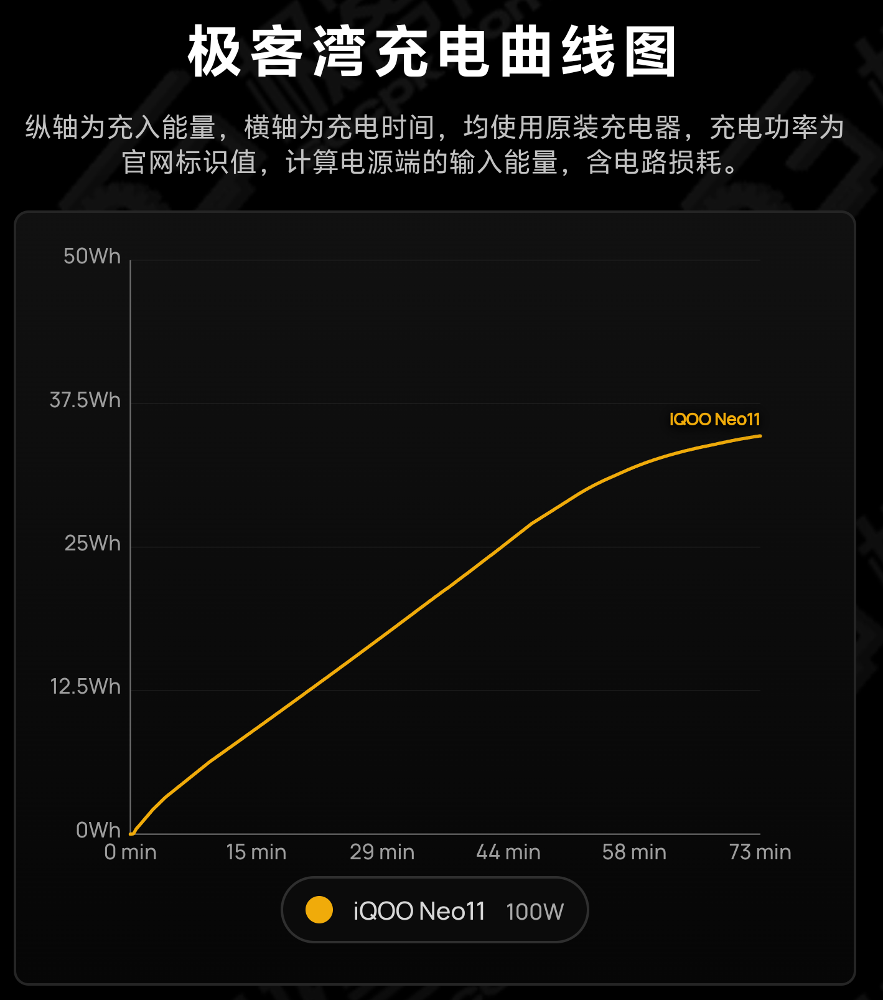

# iQOO Neo11 参数汇总

> 设备型号：V2520A

## 核心参数速览

- 骁龙 8 至尊版 + Adreno 830
- 6.82 英寸 2K AMOLED，最高 144Hz
- 7500mAh 电池 + 100W 闪充
- 5000万像素主摄（OIS）+ 800万像素超广角
- LPDDR5X Ultra + UFS 4.1
- 最高可选 16GB + 1TB

> 注：不同存储、配色版本的机身厚度和重量可能存在差异；具体参数以官方对应版本页面及实际销售版本为准。

---

## 基本信息

| 项目 | 参数 |
|---|---|
| 产品名称 | iQOO Neo11 |
| 设备型号 | V2520A |
| 产品定位 | 高性能游戏/性能旗舰型智能手机 |
| 上市时间 | 2025 年 10 月 |

---

## 处理器与性能

| 项目 | 参数 |
|---|---|
| 处理器 | 高通骁龙 8 至尊版移动平台 |
| CPU | 八核；最高主频 4.32GHz（2×4.32GHz + 6×3.53GHz） |
| GPU | Adreno 830 |
| 制程 | 3nm |
| 运行内存 | 12GB / 16GB（具体容量以版本为准） |
| 内存规格 | LPDDR5X Ultra，四通道 |
| 存储 | 256GB / 512GB / 1TB（具体容量以版本为准） |
| 闪存规格 | UFS 4.1 |
| 存储扩展 | 不支持 MicroSD 外置存储卡 |

---

## 屏幕

| 项目 | 参数 |
|---|---|
| 屏幕尺寸 | 6.82 英寸（17.32cm） |
| 屏幕比例 | 19.8:9 |
| 屏占比 | 93.88% |
| 分辨率 | 3168×1440 |
| 屏幕色彩 | 10 亿色 |
| HDR 技术 | 支持 |
| 对比度 | 8000000:1 |
| 屏幕材质 | AMOLED |
| 触摸屏 | 电容式多点触控 |
| 色彩饱和度 | 支持 P3 广色域 |
| 刷新率 | 最高支持 144Hz |

---

## 电池与充电

**电池设计：单电芯**

| 项目 | 参数 |
|---|---|
| 典型容量 | 7500mAh（3.75V） |
| 典型能量 | 28.13Wh |
| 额定容量 | 7355mAh（3.75V） |
| 额定能量 | 27.59Wh |

**充电规格：100W 闪充**

| 项目 | 参数 |
|---|---|
| 最大输入 | 100W（11V 9.1A） |
| 兼容 90W | 11V 8.2A |
| 兼容 80W | 11V 7.3A |
| 兼容 66W | 11V 6A |
| 兼容 55W | 11V 5A |
| 兼容 44W | 11V 4A |
| 反向充电 | 支持 OTG 反向充电 |

---

## 影像系统

| 项目 | 参数 |
|---|---|
| 前置摄像头像素 | 1600 万像素 |
| 前置摄像头光圈 | f/2.45 |
| 后置摄像头数量 | 双摄 |
| 后置摄像头像素 | 5000 万像素超防抖 LYT700V 索尼大底主摄 + 800 万像素超广角 |
| 后置摄像头光圈 | f/1.88（后置主摄），f/2.2（后置广角） |
| 后置闪光灯 | 支持 |
| 传感器 | CMOS |
| 防抖类型 | 后置主摄支持 OIS 防抖、后置双摄支持视频防抖 |
| 自动对焦 | 后置主摄支持 AF |
| 变焦模式 | 后置主摄支持 20 倍数字变焦 |
| 拍摄模式 | 前置：人像、拍照、录像、微电影 后置：抓拍、夜景、人像、拍照、录像、超清文档、5000万、全景、慢动作、延时摄影、时光慢门、超级月亮、专业、微电影、jovi 扫描、鱼眼 |
| 视频录制格式 | MP4 |
| 视频录制 | 前置最高支持 1080P 视频录制，后置最高支持 8K 视频拍摄，后置慢镜头最高支持 1080P |

---

## 机身

| 项目 | 参数 |
|---|---|
| 高度 | 163.37 mm |
| 宽度 | 76.71 mm |
| 厚度 | 疾影黑、驰光白、像素方橙：8.05 mm 面对疾风：8.13 mm |
| 重量 | 疾影黑：210 g 驰光白、像素方橙：215 g 面对疾风：216 g |

---

## 传感器

| 项目 | 参数 |
|---|---|
| 加速度传感器 | 支持 |
| 环境光传感器 | 支持 |
| 接近传感器 | 支持 |
| 陀螺仪 | 实体陀螺仪 |
| 电子罗盘 | 支持 |
| 其他传感器 | 前置色温传感器、超声波 3D 指纹传感器、红外遥控、Flicker 传感器、X 轴线性马达 |

---

## 网络与连接

| 项目 | 参数 |
|---|---|
| 移动网络 | 支持移动/联通/电信/广电 5G/4G 等网络 |
| 网络频段 | 2G GSM：850/900/1800MHz 3G WCDMA：B1/B4/B5/B6/B8/B19 4G TD-LTE：B34/B38/B39/B40/B41/B42/B43/B48 4G FDD-LTE：B1/B3/B4/B5/B7/B8/B18/B19/B26/B28A/B66 5G：n1/n3/n5/n7/n8/n18/n26/n28A/n38/n40/n41/n48/n66/n77/n78 |
| 网络备注 | 实时网络功能可用性取决于运营商网络可用性、基建部署以及手机软件版本 |
| SIM卡 | 双 Nano-SIM |
| 其他 | 支持 OTG 等功能 |

---

## 进网信息

| 项目 | 参数 |
|---|---|
| 设备型号 | V2520A |
| 许可证号 | 02-B220-252857 |
| 申请单位 | 维沃移动通信有限公司 |
| 生产企业 | 维沃移动通信有限公司 |
| 设备名称 | 5G 数字移动电话机 |
| 设备产地 | 广东省东莞市 |
| 发证日期 | 2025-08-28 |
| 有效期至 | 2028-08-28 |

---

## 第三方实测数据

> 以下数据来源于第三方评测机构，与官方标称数据可能存在差异。

### 安兔兔

- 来源：安兔兔跑分
- 跑分区间：311 - 318 万
- 测试温度：25°C 室温

#### 最高跑分（318 万）

| 总分 | CPU | GPU | MEM | UX |
|---|---|---|---|---|
| 3,313,064 | 960,600 | 1,183,025 | 468,020 | 701,419 |

#### 存储测试

> 25°C 室温，仅保留系统应用+安兔兔相关应用

| 顺序读 | 顺序写 | 随机读 | 随机写 | AI 读 |
|---|---|---|---|---|
| 4238.3 MB/s | 3955.2 MB/s | 1988.1 MB/s | 1031.8 MB/s | 486.5 MB/s |

#### 游戏表现

> 25°C 室温，30 分钟，最高设置

| 游戏 | 平均帧率 | 1% low 帧 | 正面最高温 | 背面最高温 |
|---|---|---|---|---|
| 原神·须弥 | 60.1 FPS | 50.1 FPS | 38.6°C | 37.6°C |
| 崩坏：星穹铁道·黄金的时刻 | 59.5 FPS | 30 FPS | 39.3°C | 38.2°C |
| 王者荣耀 | 143.8 FPS | 142.9 FPS | 37.8°C | 35.2°C |

### 极客湾

- 来源：[极客湾 5G 续航排行榜 5.0](https://www.geekbay.tv/)
- 测试对象：自购零售机

#### 5G 续航排行榜

- 测试说明：5G 网络环境下的续航测试

| 测试项 | 实测数据 |
|---|---|
| 电池能量 | 27.59Wh |
| 系统版本 | OriginOS 6 16.0.24.6 |
| 5G 续航 | 10h 8min |

#### 游戏性能（2026 手机大横评）

##### 崩坏：星穹铁道「黄金的时刻」

**25°C / 300尼特 / WiFi / 最高画质 / 分辨率非常高 / 30 分钟 / PerfDog**

| 测试项 | 实测数据 |
|---|---|
| 分辨率 | 2160×981 |
| 平均帧率 | 54.8 fps |
| 1% low 帧 | 28.8 fps |
| 整机平均功耗 | 7.8 W |
| 整机温度 | 44.8°C |

**30°C / 300尼特 / 5G / 最高画质 / 分辨率非常高 / 30 分钟 / PerfDog**

| 测试项 | 实测数据 |
|---|---|
| 分辨率 | 1679×763 |
| 平均帧率 | 59.5 fps |
| 1% low 帧 | 29.0 fps |
| 整机平均功耗 | 6.4 W |
| 整机温度 | 46.8°C |

##### 鸣潮「拉海洛跑图」

沿着拉海洛的环路骑摩托车，全程冲刺跑图。

**25°C / 300尼特 / WiFi / 最高画质 / 分辨率最高 / 30 分钟 / PerfDog**

| 测试项 | 实测数据 |
|---|---|
| 分辨率 | 1900×864 |
| 平均帧率 | 59.1 fps |
| 1% low 帧 | 27.8 fps |
| 整机平均功耗 | 5.6 W |
| 整机温度 | 44.6°C |

##### 王者荣耀「120帧巅峰赛5v5」

**25°C / 300尼特 / WiFi / 极致画质 / 功耗优先 / 15 分钟 / PerfDog**

| 测试项 | 实测数据 |
|---|---|
| 平均帧率 | 120 fps |
| 1% low 帧 | 100.9 fps |
| 整机平均功耗 | 3.5 W |
| 机身最高温 | 39.2°C |

#### 充电曲线

- 测试说明：使用原装 100W 充电器，计算电源端输入能量（含电路损耗）
- 电池额定能量：27.59Wh，满电输入能量：34.69Wh，充电效率约 74.5%

**关键时间节点**

| 充入能量 | 累计时间 |
|---|---|
| 10 Wh | 16 min |
| 20 Wh | 34 min |
| 30 Wh | 53 min |
| 34.69 Wh（满电） | 73 min |

**充电曲线图**

> 图源：极客湾 充电曲线图，纵轴为充入能量，横轴为充电时间；使用原装充电器，100W，计算电源端输入能量（含电路损耗）。
